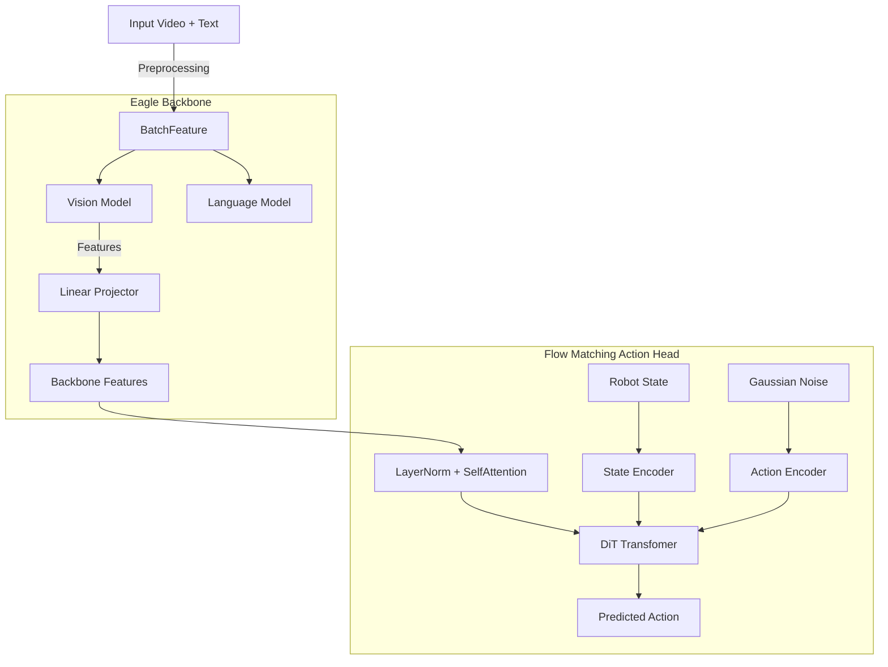

# GR00T N1.5 架构深度解析 / GR00T N1.5 Architecture Deep Analysis

本报告基于现有代码库对 GR00T N1.5 的架构进行逆向工程分析。

## 1. 核心架构概览 (High-Level Architecture)

GR00T N1.5 采用了 **"VLM Backbone + Diffusion Action Head"** 的双流架构设计。

*   **视觉语言骨干 (Backbone)**: 使用 **Eagle (Eagle2)** 模型。这是一个基于 Vision Transformer (ViT) 和 Large Language Model (LLM) 的多模态大模型。在 GR00T 中，它主要作为特征提取器。
*   **动作生成头 (Action Head)**: 使用 **Flow Matching** (流匹配) 技术的 Diffusion Transformer (DiT)。它接收 Backbone 提取的特征，通过去噪过程生成动作序列。

---

## 2. 深度组件解析 (Component Deep Dive)

### 2.1 Eagle Backbone (`EagleBackbone`)

**代码位置**: `lerobot/policies/groot/groot_n1.py` -> `EagleBackbone`

*   **设计逻辑**:
    *   **预训练基础**: 加载 `lerobot/eagle2hg-processor-groot-n1p5` 权重的 HuggingFace 模型。
    *   **层级选择**: 可以选择 LLM 的特定层输出作为特征 (`select_layer` 参数，默认 -1，即最后一层)。
    *   **微调策略**: 支持分别开启或关闭 Vision Model 和 LLM 的微调 (`tune_visual`, `tune_llm`)。
*   **输入**: 包含图像 (`pixel_values`) 和 文本 (`input_ids`) 的 `BatchFeature`。
*   **输出**: `backbone_features` (B, Sequence_Length, Hidden_Dim)。这些特征融合了视觉和语言的理解。
*   **特殊处理**:
    *   **DDP Hack**: 在 `forward` 中有一段 Dummy Gradients 代码，为了兼容 PyTorch DDP (Distributed Data Parallel) 在 `tune_visual=True` 时的行为，防止参数未使用的报错。

### 2.2 Flow Matching Action Head (`FlowmatchingActionHead`)

**代码位置**: `lerobot/policies/groot/action_head/flow_matching_action_head.py`

这是 N1.5 的核心创新点，使用 Flow Matching 替代了传统的 DDPM/DDIM。

#### A. 输入处理
1.  **Backbone Features**: 来自 Eagle 的特征。
    *   经过 `vlln` (LayerNorm) 和 `vl_self_attention` (SelfAttentionTransformer) 进行进一步的特征融合与对齐。
2.  **State (Proprioception)**: 机器人的本体感觉状态。
    *   使用 `State Encoder` (CategorySpecificMLP) 编码。支持多机型 (Multi-Embodiement)，根据 `embodiment_id` 选择不同的权重。
3.  **Action / Noise**:
    *   **训练时**: 输入真实动作 `actions`，混合高斯噪声生成 `noisy_trajectory`。
    *   **推理时**: 输入纯高斯噪声。
    *   使用 `Action Encoder` (MultiEmbodimentActionEncoder) 编码。

#### B. 核心 DiT (Diffusion Transformer)
**代码位置**: `lerobot/policies/groot/action_head/cross_attention_dit.py` -> `DiT`

*   **架构**: 这是一个标准的 Transformer Decoder 结构，类似于 DiT 论文。
*   **Conditioning**:
    *   **Cross Attention**: `encoder_hidden_states` 是 Eagle Backbone 的特征。这意味着 DiT 的每一层都通过 Cross Attention "看" 视觉和语言信息。
    *   **Input Tokens**: `sa_embs` (Self-Attention Embeddings) 是拼接了 `[State_Embeddings, Future_Tokens, Action_Embeddings]` 的序列。
    *   **Timestep**: 扩散步数 `t` 被编码后注入到每一层 (AdaLayerNorm)。

#### C. 输出生成
*   DiT 的输出经过 `Action Decoder` 映射回动作维度。
*   **Flow Matching Loss**: 预测的目标是 **Velocity** (速度场) `u_t = x_1 - x_0` (Target Data - Source Noise)。
*   Loss Function: MSE Loss between `pred_actions` and `velocity`.

---

## 3. 关键数据流 (Data Flow)

1.  **输入图像** -> `EagleBackbone` -> **通用多模态特征** (富含语义)。
2.  **通用特征** -> `ActionHead.vl_self_attention` -> **动作相关特征** (对齐到动作空间)。
3.  **动作相关特征** -> `DiT Cross Attention Key/Value`。
4.  **噪声/动作 Query** -> `DiT Self Attention` -> `DiT Cross Attention` -> **去噪后的动作特征**。
5.  **去噪特征** -> MLP -> **最终机器人关节动作**。

---

## 4. 为什么选择 GR00T N1.5? (Strengths)

*   **强大的语义理解**: 由于使用了 Eagle (LLM基础)，它对文本指令和复杂视觉场景的理解能力远超简单的 ResNet/ViT。
*   **流匹配生成**: Flow Matching 通常比标准 Diffusion 收敛更快，生成质量更高，推理步数更少。
*   **多机型支持**: 原生设计了 `CategorySpecificMLP`，通过 `embodiment_id` 控制，可以在同一个模型权重中支持多种不同构型的机器人（如 Unitree H1, G1 等）。

## 5. Potential Weaknesses (本次改进的切入点)

尽管 Eagle 提供了强大的语义特征，但它是 **"隐式"** 的。模型需要自己学会 "关注哪里"。
*   **Object-Centricity**: 如果我们已经明确知道要操作 "绿色杯子"，并且有 SAM2 提供了精确的 Mask，目前的 GR00T 并没有显式的通道来利用这个 Mask 信息。它只能依赖 Cross Attention 自己去 Eagle 特征里找。
*   **改进机会**: **ControlVLA** 的核心思想就是 **显式注入** Mask 信息。告诉模型 "就是这里，看这里"。这可以大幅提升操作精度和少样本学习能力。
