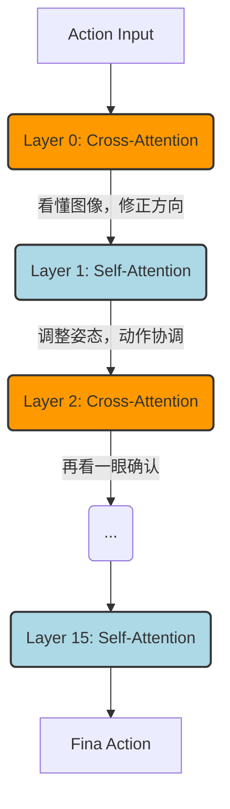

# GR00T 推理逻辑与残差机制深度追踪 (Deep Trace)

本文件提供了 GR00T 模型推理过程的深度代码追踪，重点 analysis **视觉语言模型 (VLM)** 特征如何通过 **Diffusion Transformer (DiT)** 影响 **动作生成 (Action Generation)**。

## 🚀 核心摘要：双重残差机制 (The Dual Residual Mechanism)

通过代码审计，我们确认 GR00T 在生成动作时采用了**双重残差机制**，这确保了动作的平滑性与对视觉环境的高度敏感性：

1.  **宏观层面残差（时间积分 - Macro-Level Residual）**：
    *   在 **去噪循环 (Denoising Loop)**（基于 Flow Matching）中，动作轨迹是迭代更新的：
    *   $Action_{t+1} = Action_{t} + \Delta t \cdot Velocity_{pred}$
    *   这在物理意义上等同于 **欧拉积分 (Euler Integration)**。模型预测的是动作的变化率（速度），而非绝对位置，从而实现了更稳定的轨迹演化。

2.  **微观层面残差（特征精炼 - Micro-Level Residual）**：
    *   在 **DiT Transformer Blocks** 内部，特征通过层级结构进行精炼：
    *   $Feature_{L+1} = Feature_{L} + Attention(Feature_{L}, VLM\_Context)$
    *   这种“插件式”结构意味着 VLM 特征在每一层都充当**修正梯度 (Correction Gradients)**，不断调整动作 token 的表示。

---

## 🔍 逐步骤代码追踪 (Step-by-Step Code Trace)

### 第一阶段：推理入口 (Inference Entry Point)
**文件：** [eval_g1.py](../unitree_lerobot/eval_robot/eval_g1.py)

这是 Unitree G1 机器人在真实环境或仿真中运行的起点。脚本捕获图像和机器人状态（Proprioceptive State），并向 Policy 请求动作。

*   **[[eval_g1.py:L130]](../unitree_lerobot/eval_robot/eval_g1.py#L130)**: 调用 `predict_action(observation, policy, ...)`。
    ```python
    action = predict_action(...)
    ```
    此处的 `observation` 包含了来自 RealSense 或虚拟相机的 RGB 图像以及机器人的关节状态。

### 第二阶段：策略封装与队列管理 (Policy Wrapper & Queue Management)
**文件：** [utils.py](../unitree_lerobot/eval_robot/utils/utils.py) 与 [modeling_groot.py](../unitree_lerobot/lerobot/src/lerobot/policies/groot/modeling_groot.py)

*   **[[utils.py:L70]](../unitree_lerobot/eval_robot/utils/utils.py#L70)**: 调用 `policy.select_action(observation)`。
*   **[[modeling_groot.py:L161]](../unitree_lerobot/lerobot/src/lerobot/policies/groot/modeling_groot.py#L161)**: `GrootPolicy` 类管理着一个动作块队列（Action Chunk Queue），实现 **后退地平线控制 (Receding Horizon Control, RHC)**。
    *   如果队列为空，则触发一次完整的模型推理：`self.predict_action_chunk(batch)`。
*   **[[modeling_groot.py:L146]](../unitree_lerobot/lerobot/src/lerobot/policies/groot/modeling_groot.py#L146)**: 调用底层模型：`self._groot_model.get_action(groot_inputs)`。
    > **技术细节**：在此处会将输入转换为 `bfloat16` 精度，以利用 NVIDIA GPU 的 Tensor Cores 加速推理。

### 第三阶段：“双脑”协调器 (The "Dual Brain" Coordinator)
**文件：** [groot_n1.py](../unitree_lerobot/lerobot/src/lerobot/policies/groot/groot_n1.py)

`GR00TN15` 类负责编排视觉骨干网络 (Eagle Backbone) 和动作头 (Action Head)。

*   **[[groot_n1.py:L315]](../unitree_lerobot/lerobot/src/lerobot/policies/groot/groot_n1.py#L315)**: **视觉前向传播 (Vision Pass)**。图像通过 Eagle Backbone：
    ```python
    backbone_outputs = self.backbone(backbone_inputs)
    ```
    *   这生成了 **VLM 嵌入向量 (`vl_embs`)**。这些向量承载了语义信息（如“抓取杯子”）和空间信息（杯子的位置坐标），作为动作生成的上下文 (Context)。
*   **[[groot_n1.py:L316]](../unitree_lerobot/lerobot/src/lerobot/policies/groot/groot_n1.py#L316)**: **动作前向传播 (Action Pass)**。调用 `self.action_head.get_action(...)`，将 `vl_embs` 注入。

### 第四阶段：动作头与去噪循环 (Action Head & Denoising Loop)
**文件：** [flow_matching_action_head.py](../unitree_lerobot/lerobot/src/lerobot/policies/groot/action_head/flow_matching_action_head.py)

这是 **流匹配 (Flow Matching)** 算法的核心实现，用于从噪声中提取结构化动作。

*   **[[flow_matching_action_head.py:L359]](../unitree_lerobot/lerobot/src/lerobot/policies/groot/action_head/flow_matching_action_head.py#L359)**: 使用纯高斯噪声初始化 `actions`。
*   **[[flow_matching_action_head.py:L369]](../unitree_lerobot/lerobot/src/lerobot/policies/groot/action_head/flow_matching_action_head.py#L369)**: **去噪循环**（通常为 10-16 个步长）。
    *   **特征准备**：
        *   使用 `self.action_encoder` 对当前带噪动作进行编码。
        *   **[flow_matching_action_head.py:L384]**: **拼接 (Concatenation)**。DiT 的输入序列通常为：`[State_Tokens | Future_Tokens | Action_Tokens]`。
        *   **注意**：VLM Token (`vl_embs`) **不会**直接拼接到序列中，而是作为 `encoder_hidden_states` 通过 Cross-Attention 注入。
    *   **[flow_matching_action_head.py:L387]**: **DiT 前向传播**。
        ```python
        model_output = self.model(
            hidden_states=sa_embs,          # 查询 (Query)：机器人的意图与当前动作状态
            encoder_hidden_states=vl_embs,  # 键/值 (Key/Value)：视觉世界特征
            timestep=timesteps_tensor       # 扩散步长：决定去噪的强度
        )
        ```
    *   **[flow_matching_action_head.py:L397]**: **宏观残差更新**。
        ```python
        actions = actions + dt * pred_velocity
        ```

### 第五阶段：Transformer 块（微观残差） (The Transformer Block)
**文件：** `lerobot/src/lerobot/policies/groot/action_head/cross_attention_dit.py`

在 `DiT` 内部，特别是 `BasicTransformerBlock.forward` 函数中：

*   **[cross_attention_dit.py:L164]**: **交叉注意力 (Cross-Attention)**。
    *   **Query** = 动作特征 (Action Features)。
    *   **Key/Value** = VLM 特征 (`vl_embs`)。
    *   此步骤计算“图像中的哪些部分（如杯柄）与我当前的动作计划（如手部张开）相关”。
*   **[cross_attention_dit.py:L173]**: **微观残差连接 (Micro Residual Connection)**。
    ```python
    hidden_states = attn_output + hidden_states
    ```
    注意力机制的输出被**加**到现有特征上。这证明了 VLM 特征的作用是**调整**或**引导**动作表示，而不是重写它。

## 🏗 逻辑结论

GR00T 从视觉到动作的信息流是 **加性 (Additive)** 且 **迭代 (Iterative)** 的：

1.  **VLM 特征是常量**：在单次推理步中，`vl_embs` 只计算一次，在整个去噪循环中保持不变。
2.  **动作是变量**：`action` 向量在去噪过程中不断演化。
3.  **交叉注意力是桥梁**：
    *   在 DiT 的每一层中，模型都会对比当前的动作状态与视觉上下文。
    *   计算出一个“修正向量 (Correction Vector)”。
    *   该修正量被叠加到动作状态上。
    *   假设 DiT 深度为 16 层，去噪步数为 10 步，则每次预测动作前会进行 **160 次迭代精炼**！这种高频次的反馈循环是 GR00T 实现高精度人形控制的关键。

# GR00T 推理逻辑与核心机制深度解析

本文档旨在通过代码追踪，用通俗易懂的中文为您解析 GR00T 模型在推理阶段的三个核心问题：
1.  **Wrapper (包装器) 是什么？**
2.  **动作队列 (Queue) 是如何管理的？**
3.  **DiT 内部的 Cross/Self Attention 是如何交替工作的？**

---

## 1. 什么是 Wrapper (包装器)？

**文件**: [unitree_lerobot/lerobot/src/lerobot/policies/groot/modeling_groot.py](../unitree_lerobot/lerobot/src/lerobot/policies/groot/modeling_groot.py)

`GrootPolicy` 就是一个 **"翻译官" (Wrapper)**。

*   **它的指责**: LeRobot 框架有一套标准接口（比如 `select_action`），而 GR00T 模型内核（Isaac-GR00T）有另一套接口（比如 `get_action`）。Wrapper 的作用就是把 LeRobot 的请求“翻译”给 GR00T 内核听。
*   **如果不加 Wrapper**: 您的评估脚本 `eval_g1.py` 根本无法直接调用 GR00T，因为函数名和参数格式都对不上。Wrapper 帮您处理了数据格式转换、设备移动等脏活累活。

---

## 2. 动作队列 (Action Queue) 管理机制

**核心概念**: **Receding Horizon Control (滚动时域控制)**

GR00T 不是“看一眼，走一步”，而是 **“看一眼，规划未来 50 步，但只走第 1 步”**。

**代码逻辑**: [modeling_groot.py:L156](../unitree_lerobot/lerobot/src/lerobot/policies/groot/modeling_groot.py#L156)

```python
def select_action(self, batch):
    # 1. 检查手里还有没有存货
    if len(self._action_queue) == 0:
        # 2. 如果没了，就让大模型推理一次
        # 这次推理会一次性吐出未来 N 步 (Chunk) 的动作序列 (例如 50 个点)
        actions = self.predict_action_chunk(batch)
        
        # 3. 把这主要的一一进货到队列里
        self._action_queue.extend(actions)
    
    # 4. 每次只拿走队列里的第一个动作去执行
    return self._action_queue.popleft()
```

*   **为什么要这样？**
    *   **平滑性**: 防止机器人动作一顿一顿的。
    *   **容错性**: 即使某一帧推理慢了，队列里还有存货，机器人不会通过发呆。

---

## 3. DiT 内部结构：交替 Attention 之谜

**文件**: [lerobot/src/lerobot/policies/groot/action_head/cross_attention_dit.py](../unitree_lerobot/lerobot/src/lerobot/policies/groot/action_head/cross_attention_dit.py)

您问得非常专业，DiT 的确不是每一层都做一样的事，而是像 **"三明治"** 一样交替进行的。

### 总览
GR00T 的 DiT 一共有 **16 层 Transformer Block**。

*   **偶数层 (0, 2, ..., 14)**: **Cross-Attention 层** (负责 "看世界")
*   **奇数层 (1, 3, ..., 15)**: **Self-Attention 层** (负责 "理思路")

### 代码实证
在 `DiT` 类的初始化中 ([L225](../unitree_lerobot/lerobot/src/lerobot/policies/groot/action_head/cross_attention_dit.py#L225)):
```python
for idx in range(num_layers):
    # 只有奇数层 (idx % 2 == 1) 才启用 Self-Attention 模式
    # 偶数层则使用 Cross-Attention 模式
    use_self_attn = idx % 2 == 1 and interleave_self_attention
```

### 每一层具体在干什么？

#### 🟢 偶数层 (Layer 0, 2, ...): Cross-Attention
*   **输入**: 
    *   **Query**: 当前的动作意图 (Action Tokens)
    *   **Key/Value**: **VLM 视觉特征 (Eagle Features)**
*   **作用**: **"校准"**。
    *   动作会问：“杯子在哪里？”
    *   VLM 回答：“在左边 x=200 处。”
    *   动作：“好，我往左移一点。” -> **这就是微观残差修正**。

#### 🔵 奇数层 (Layer 1, 3, ...): Self-Attention
*   **输入**: 
    *   **Query/Key/Value**: 都是动作意图自己 (Action Tokens)
*   **作用**: **"自洽"**。
    *   VLM 这一层 **完全不参与**。
    *   动作自己思考：“我的手肘如果往左，手腕是不是也要跟着转一下才协调？”
    *   它负责保证生成的动作符合机器人的物理约束和运动学规律。

### 总结图示



# GR00T 推理逻辑与核心机制深度解析

本文档旨在通过代码追踪，用通俗易懂的中文为您解析 GR00T 模型在推理阶段的三个核心问题：
1.  **Wrapper (包装器) 是什么？**
2.  **动作队列 (Queue) 是如何管理的？**
3.  **DiT 内部的 Cross/Self Attention 是如何交替工作的？**

---

## 1. 什么是 Wrapper (包装器)？

**文件**: [unitree_lerobot/lerobot/src/lerobot/policies/groot/modeling_groot.py](../unitree_lerobot/lerobot/src/lerobot/policies/groot/modeling_groot.py)

`GrootPolicy` 就是一个 **"翻译官" (Wrapper)**。

*   **它的指责**: LeRobot 框架有一套标准接口（比如 `select_action`），而 GR00T 模型内核（Isaac-GR00T）有另一套接口（比如 `get_action`）。Wrapper 的作用就是把 LeRobot 的请求“翻译”给 GR00T 内核听。
*   **如果不加 Wrapper**: 您的评估脚本 `eval_g1.py` 根本无法直接调用 GR00T，因为函数名和参数格式都对不上。Wrapper 帮您处理了数据格式转换、设备移动等脏活累活。

---

## 2. 动作队列 (Action Queue) 管理机制

**核心概念**: **Receding Horizon Control (滚动时域控制)**

GR00T 不是“看一眼，走一步”，而是 **“看一眼，规划未来 50 步，但只走第 1 步”**。

**代码逻辑**: [modeling_groot.py:L156](../unitree_lerobot/lerobot/src/lerobot/policies/groot/modeling_groot.py#L156)

```python
def select_action(self, batch):
    # 1. 检查手里还有没有存货
    if len(self._action_queue) == 0:
        # 2. 如果没了，就让大模型推理一次
        # 这次推理会一次性吐出未来 N 步 (Chunk) 的动作序列 (例如 50 个点)
        actions = self.predict_action_chunk(batch)
        
        # 3. 把这主要的一一进货到队列里
        self._action_queue.extend(actions)
    
    # 4. 每次只拿走队列里的第一个动作去执行
    return self._action_queue.popleft()
```

*   **为什么要这样？**
    *   **平滑性**: 防止机器人动作一顿一顿的。
    *   **容错性**: 即使某一帧推理慢了，队列里还有存货，机器人不会通过发呆。

---

## 3. DiT 内部结构：交替 Attention 之谜

**文件**: [lerobot/src/lerobot/policies/groot/action_head/cross_attention_dit.py](../unitree_lerobot/lerobot/src/lerobot/policies/groot/action_head/cross_attention_dit.py)

您问得非常专业，DiT 的确不是每一层都做一样的事，而是像 **"三明治"** 一样交替进行的。

### 总览
GR00T 的 DiT 一共有 **16 层 Transformer Block**。

*   **偶数层 (0, 2, ..., 14)**: **Cross-Attention 层** (负责 "看世界")
*   **奇数层 (1, 3, ..., 15)**: **Self-Attention 层** (负责 "理思路")

### 代码实证
在 `DiT` 类的初始化中 ([L225](../unitree_lerobot/lerobot/src/lerobot/policies/groot/action_head/cross_attention_dit.py#L225)):
```python
for idx in range(num_layers):
    # 只有奇数层 (idx % 2 == 1) 才启用 Self-Attention 模式
    # 偶数层则使用 Cross-Attention 模式
    use_self_attn = idx % 2 == 1 and interleave_self_attention
```

### 每一层具体在干什么？

#### 🟢 偶数层 (Layer 0, 2, ...): Cross-Attention
*   **输入**: 
    *   **Query**: 当前的动作意图 (Action Tokens)
    *   **Key/Value**: **VLM 视觉特征 (Eagle Features)**
*   **作用**: **"校准"**。
    *   动作会问：“杯子在哪里？”
    *   VLM 回答：“在左边 x=200 处。”
    *   动作：“好，我往左移一点。” -> **这就是微观残差修正**。

#### 🔵 奇数层 (Layer 1, 3, ...): Self-Attention
*   **输入**: 
    *   **Query/Key/Value**: 都是动作意图自己 (Action Tokens)
*   **作用**: **"自洽"**。
    *   VLM 这一层 **完全不参与**。
    *   动作自己思考：“我的手肘如果往左，手腕是不是也要跟着转一下才协调？”
    *   它负责保证生成的动作符合机器人的物理约束和运动学规律。

### 总结图示

